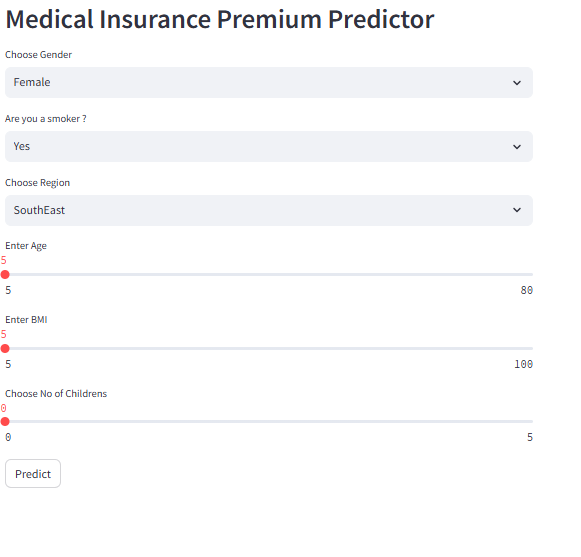
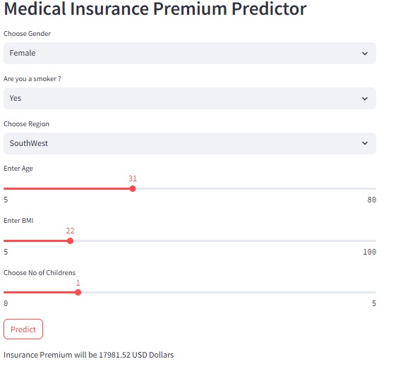

# 🏥 Health Insurance Price Prediction

A Machine Learning–powered web application that predicts **health insurance premiums price** based on user information such as age, BMI, smoking habits, region, and number of children.  
The application is built using **Python, Scikit-learn, and Streamlit** and provides real-time predictions through an interactive UI.

---

## 🚀 Live Application Preview

### 🔹 User Input Interface


### 🔹 Prediction Output


---

## 📌 Problem Statement

Health insurance premiums depend on multiple personal and lifestyle factors.  
Manually estimating insurance costs is difficult and error-prone.

This project solves that problem by:
- Training a regression-based ML model
- Deploying it as an interactive web application
- Allowing users to instantly estimate insurance costs

---

## 🧠 Machine Learning Approach

- **Type:** Supervised Learning (Regression)
- **Model Used:** Tree-based Regression Model
- **Target Variable:** Insurance Premium (USD)
- **Features Used:**
  - Age
  - Gender
  - BMI
  - Smoking status
  - Region
  - Number of children

The model was trained using historical insurance data and serialized using `pickle` for deployment.

---

## 🛠 Tech Stack

- **Programming Language:** Python  
- **Libraries:**  
  - NumPy  
  - Pandas  
  - Scikit-learn  
- **Web Framework:** Streamlit  
- **Model Serialization:** Pickle
  

---
Health-Insurance_price_prediction/
│
├── App.py # Streamlit web application
├── Main.ipynb # Model training notebook
├── insurance.csv # Dataset
├── MIPML.pkl # Trained ML model
├── requirements.txt # Project dependencies
├── .gitignore # Git ignore rules
└── images/ # Screenshots for README


---

## ▶️ How to Run the Project Locally

### 1️⃣ Clone the repository
```bash
git clone https://github.com/rohancodess/Health-Insurance_price_prediction.git
cd Health-Insurance_price_prediction

pip install -r requirements.txt

streamlit run App.py

http://localhost:8501


## ⚙️ Project Structure

